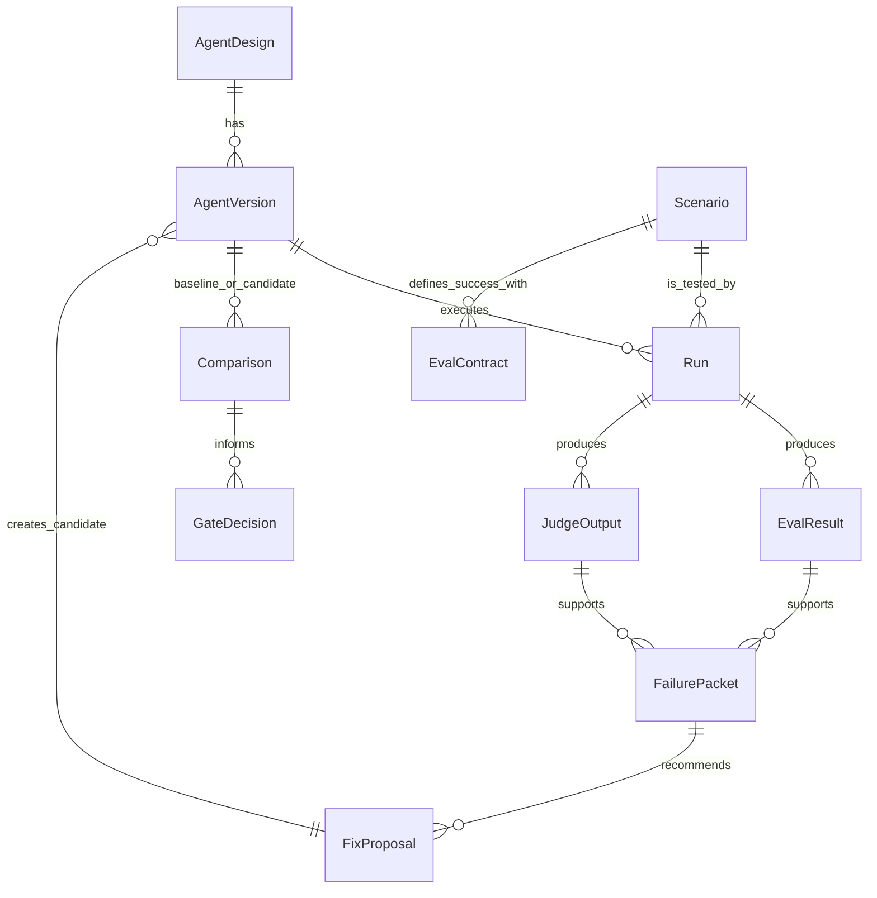

The intended data model follows the Eval-Driven Design loop.

## Entity summary

| Entity | Purpose |
| --- | --- |
| `AgentDesign` | Durable intent and product contract for an agent. |
| `AgentVersion` | Concrete revision being evaluated. |
| `Scenario` | Situation or task the agent must handle. |
| `EvalContract` | Criteria and evidence required to judge success. |
| `Run` | Execution of an agent version against a scenario. |
| `EvalResult` | Result from deterministic, metric, or rubric evaluation. |
| `JudgeOutput` | LLM or human judgment output with rationale and score. |
| `FailurePacket` | Evidence-backed diagnosis of a failure. |
| `FixProposal` | Bounded recommended change. |
| `Comparison` | Baseline versus candidate evaluation under shared conditions. |
| `GateDecision` | Pass, fail, or review decision for a candidate. |

## Evidence references

Entities that depend on external evidence should carry stable references to the evidence system. For Langfuse, that may include trace IDs, observation IDs, score IDs, dataset item IDs, or artifact URLs.
