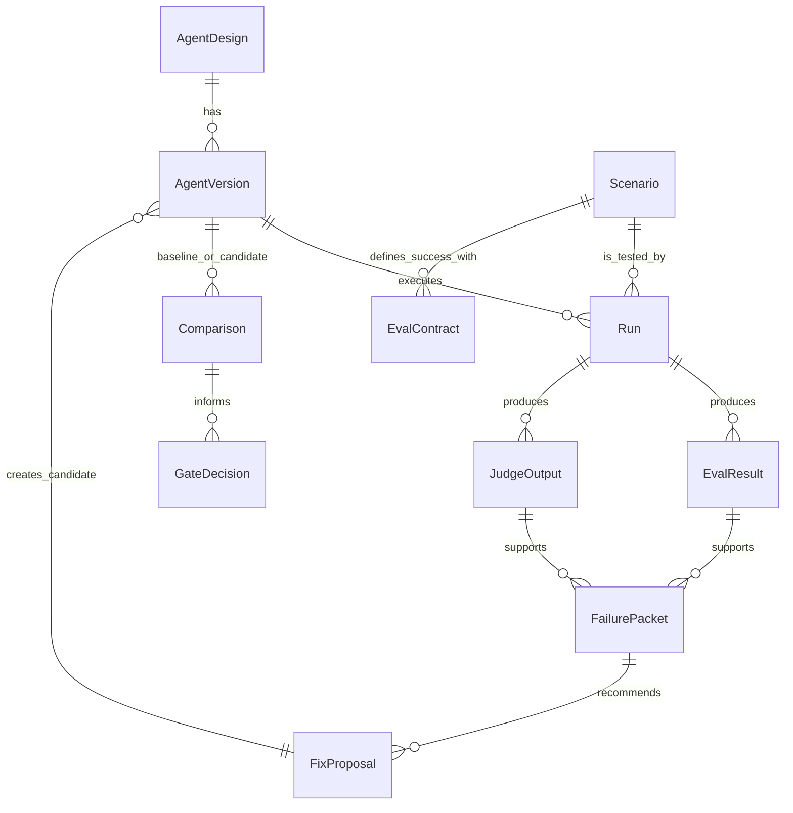
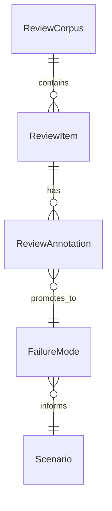

The data model follows the Eval-Driven Design loop, extended with Error Analysis entities.

## Core EDD spine

## Error Analysis entities

Error Analysis works on top of live runs in Langfuse. A `ReviewCorpus` collects `ReviewItem` records (one per trace). Reviewers add comments in Langfuse; those comments sync back as `ReviewAnnotation` records. Recurring annotations are promoted to named `FailureMode` objects, which inform new `Scenario` and `EvalContract` definitions.

## Entity summary

| Entity | Purpose |
| --- | --- |
| `AgentDesign` | Durable intent and product contract for an agent. |
| `AgentVersion` | Concrete revision being evaluated: prompts, tools, model settings, runner config. |
| `Scenario` | Situation or task the agent must handle. |
| `EvalContract` | Criteria and evidence required to judge success. |
| `Run` | Execution of an agent version against a scenario. |
| `EvalResult` | Result from a deterministic check, score, rubric, or metric. |
| `JudgeOutput` | LLM or human judgment with rationale and score. |
| `FailurePacket` | Evidence-backed diagnosis of a failure. |
| `FixProposal` | Bounded recommended change derived from a failure packet. |
| `Comparison` | Baseline versus candidate evaluation under shared conditions. |
| `GateDecision` | Pass, fail, or review decision for a candidate version. |
| `ReviewCorpus` | Named collection of live runs pulled for error analysis. |
| `ReviewItem` | Single trace entry in a review corpus, linked to a Langfuse trace. |
| `ReviewAnnotation` | Trace comment synced from Langfuse to the platform. |
| `FailureMode` | Named, recurring failure pattern promoted from review annotations. |

## Artifact types

Runs produce artifacts stored as typed records. Common artifact types:

| Type | Meaning |
| --- | --- |
| `RUN_RESULT` | Agent execution output. |
| `TRACE_REF` | Link to a Langfuse trace for this run. |
| `EVAL_RESULT` | Output of a deterministic or rubric check. |
| `JUDGE_OUTPUT` | LLM judge evaluation with rationale. |

## Evidence references

Entities that depend on external evidence carry stable references to the evidence system. For Langfuse that includes trace IDs, observation IDs, score IDs, dataset item IDs, and artifact URLs.
