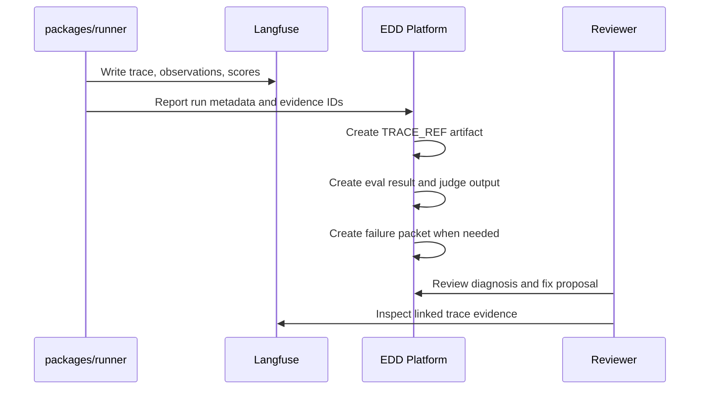
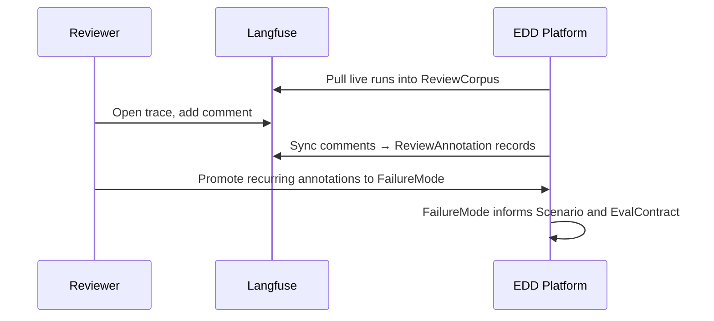

Langfuse is the evidence data plane for traces, observations, scores, datasets, prompts, and related artifacts.

## Required vs. optional

Langfuse is **required** for the Error Analysis tab. Without it, the platform cannot build a review corpus from live runs or sync trace comments into `ReviewAnnotation` records.

Langfuse is **recommended but optional** for the Proof Loop. When configured, agent runs, tool spans, and live judge calls appear on the same Langfuse trace, and the platform stores a `TRACE_REF` artifact with a direct link.

## Integration model

The platform stores references such as:

- Langfuse trace IDs.
- Observation IDs.
- Score IDs.
- Dataset item IDs.
- Prompt or prompt version references.
- URLs or artifact references.

Those references are attached to `Run`, `EvalResult`, `JudgeOutput`, `FailurePacket`, and `ReviewAnnotation` records.

## What the platform does not duplicate

The platform does not copy every trace event, observation payload, or token-level detail into its own database. It preserves enough references and summaries for workflow decisions, then lets reviewers open the detailed evidence in Langfuse when needed.

## Evidence lifecycle — Proof Loop



## Evidence lifecycle — Error Analysis



## Local setup

To run Langfuse locally with Docker:

```bash
./scripts/dev_langfuse.sh
```

Langfuse runs at `http://localhost:3001`. Local credentials are documented in the product repo README.
