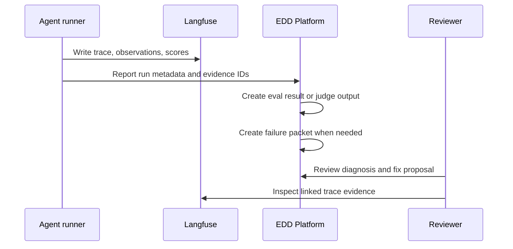

Langfuse is the evidence data plane for traces, observations, scores, datasets, prompts, and related artifacts.

EDD Platform should use Langfuse evidence to support diagnosis and decisions, while keeping platform workflow state focused on the EDD loop.

## Integration model

The platform can store references such as:

- Langfuse trace IDs.
- Observation IDs.
- Score IDs.
- Dataset item IDs.
- Prompt or prompt version references.
- URLs or artifact references.

Those references can be attached to `Run`, `EvalResult`, `JudgeOutput`, and `FailurePacket` records.

## What the platform should not duplicate

The platform does not need to copy every trace event, observation payload, or token-level detail into its own database. Instead, it should preserve enough references and summaries for workflow decisions, then let reviewers open the detailed evidence in Langfuse when needed.

## Evidence lifecycle

