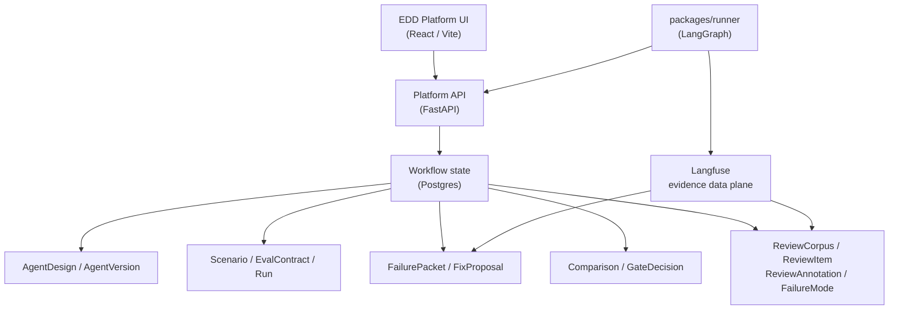

EDD Platform sits between agent execution environments and evidence stores.

## Responsibilities

**EDD Platform** owns the workflow/control plane:

- Agent designs and versions.
- Scenarios and eval contracts.
- Run records and evidence references.
- Failure packets and fix proposals.
- Comparisons and gate decisions.
- Review corpora, annotations, and failure modes (Error Analysis).
- Product UI for reviewing and deciding.

**Langfuse** owns trace and eval evidence:

- Traces and observations.
- Scores and judge outputs.
- Datasets and prompts.
- Evidence artifacts linked from platform records.
- Trace comments synced to platform `ReviewAnnotation` records.

**packages/runner** executes agents using LangGraph. It produces run outputs, reports run metadata and evidence IDs to the platform API, and writes traces to Langfuse.

## Package structure

| Package | Language | Responsibility |
| --- | --- | --- |
| `apps/web` | TypeScript / React | Product UI, wizard flow, evidence views |
| `apps/api` | Python / FastAPI | Project state, artifacts, judges, gates |
| `packages/domain` | Python | Shared object vocabulary and Pydantic schemas |
| `packages/runner` | Python / LangGraph | Agent execution harness |
| `packages/langfuse-adapter` | Python | Trace reference and observability integration |

## Design principle

The platform references detailed evidence without duplicating every trace payload. This keeps workflow state focused while preserving links to the underlying evidence in Langfuse.
