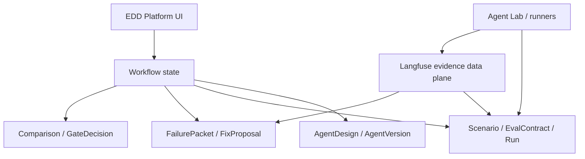

EDD Platform is intended to sit between agent execution environments and evidence stores.

## Responsibilities

EDD Platform owns the workflow/control plane:

- Agent designs and versions.
- Scenarios and eval contracts.
- Run records and evidence references.
- Failure packets and fix proposals.
- Comparisons and gate decisions.
- Product UI for reviewing and deciding.

Langfuse owns trace and eval evidence:

- Traces and observations.
- Scores and judge outputs.
- Datasets and prompts.
- Evidence artifacts linked from platform records.

Agent Lab or external runners execute agents and produce outputs. They may write evidence to Langfuse and report run metadata back to the platform.

## Design principle

The platform should reference detailed evidence without duplicating every trace payload. This keeps workflow state focused while preserving links to the underlying evidence.
