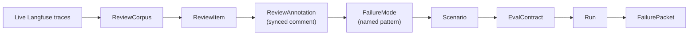

The Error Analysis tab helps teams identify recurring failure patterns by reviewing live agent traces in Langfuse and promoting recurring observations to named failure modes.

**Langfuse is required** for this workflow. Without it, there are no traces to pull into a review corpus.

## The four steps

### Step 1 — Build review set

Pull live runs from Langfuse into a `ReviewCorpus`. The platform creates a `ReviewItem` record for each selected trace. This is your working set for the review session.

### Step 2 — Review and code

For each `ReviewItem`, open the trace in Langfuse and add comments that describe what went wrong. When you return to the platform, click **Sync comments** to pull those Langfuse comments back as `ReviewAnnotation` records.

Each annotation captures:

- The trace reference.
- The comment text.
- The reviewer identity.

### Step 3 — Confirm failure modes

Review the synced annotations across all items in the corpus. When you see a pattern appearing multiple times, promote it to a named `FailureMode`. A failure mode is a durable, reusable label for a recurring class of agent behavior.

Good failure modes are:

- Specific enough to describe a reproducible pattern.
- General enough to apply to more than one trace.
- Named in terms of observable agent behavior, not implementation guesses.

### Step 4 — Done

The failure mode taxonomy is now available to inform new `Scenario` and `EvalContract` definitions. Use [Create a First Eval Loop](/guides/create-first-eval-loop) to turn a named failure mode into a test case.

## How failure modes connect to the EDD loop



Error Analysis feeds the top of the EDD loop. Instead of writing synthetic test cases from intuition, teams derive scenarios and eval contracts from observed production failures.

## Local setup

To use Error Analysis locally, start the app with Langfuse enabled:

```bash
./scripts/dev_langfuse.sh
```

Then seed a demo project to generate traces:

```bash
python scripts/seed_sentiment_observer_demo.py
```

Open the Error Analysis tab, pull runs into a corpus, add comments in Langfuse at `http://localhost:3001`, and sync them back to the platform.
