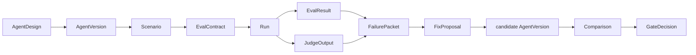

EDD Platform is a workflow and control plane for improving AI agents from evidence instead of vibes.

The platform is intended to help teams design agents, define scenarios and eval contracts, run versions, capture evidence, diagnose failures, propose bounded fixes, compare candidates, and make gate decisions.

## The core loop

This loop makes agent work reviewable. A prompt change or implementation change should be connected to a scenario, an expected behavior, observed evidence, a diagnosis, and a comparison against a baseline.

## What problem it solves

Agent development can drift when teams rely on memorable examples, one-off demos, or intuition alone. EDD Platform is designed around a few recurring problems:

- Agent quality can regress invisibly.
- Prompt changes are hard to justify without evidence.
- Evals can become disconnected from the failures users actually see.
- Teams need a repeatable way to compare versions and decide whether a change should pass a gate.

## Platform, lab, and Langfuse

EDD Platform owns workflow state: `AgentDesign`, `AgentVersion`, `FailurePacket`, `FixProposal`, `Comparison`, `GateDecision`, and the product UI around those objects.

Langfuse is the trace and eval evidence data plane. It stores traces, observations, scores, datasets, prompts, and evidence artifacts. The platform can reference Langfuse trace IDs and artifacts without copying every trace payload into its own state.

Agent Lab, workbenches, or external runners execute agents and produce outputs. The platform coordinates the Eval-Driven Design workflow around those outputs.

## Start here

<CardGroup cols={2}>
  <Card title="Quickstart" icon="rocket" href="/quickstart">
    Understand the documentation structure and preview the Mintlify site locally.
  </Card>
  <Card title="Eval-Driven Design" icon="route" href="/concepts/eval-driven-design">
    Learn the core product thesis and workflow.
  </Card>
  <Card title="Architecture" icon="network" href="/architecture/overview">
    See how the platform, runners, and Langfuse fit together.
  </Card>
  <Card title="Glossary" icon="book-open" href="/reference/glossary">
    Review the canonical vocabulary used throughout the project.
  </Card>
</CardGroup>
