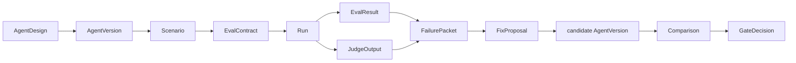

EDD Platform is a workflow and control plane for improving AI agents from evidence instead of vibes.

The platform helps teams design agents, define scenarios and eval contracts, run versions, capture evidence, diagnose failures, propose bounded fixes, compare candidates, and make gate decisions.

Two canonical examples are included: the **Sentiment Observer** (a conversation-monitoring agent that detects worsening sentiment or escalation risk) and the **Customer Triage** agent (a support ticket router). Both are seeded via scripts and exercise the full product spine.


## The core loop

The product workflow is:

```text
Observe -> Analyze -> Measure -> Improve -> Compare -> Gate
```

Under the hood, that workflow maps to the EDD object spine:



This loop makes agent work reviewable. A prompt change, tool change, or workflow change should be connected to a scenario, expected behavior, observed evidence, a diagnosis, and a comparison against a baseline.

## The four main tabs

The platform UI is organized around four tabs:

- **Agent Design** — create and edit agent designs, manage tool enablement, review platform-owned tool definitions.
- **Proof Loop** — run the agent live against a test, evaluate output with deterministic checks and an LLM judge, and work through the guided wizard to name failures, propose fixes, and compare versions.
- **Error Analysis** — build a review corpus from live runs, sync Langfuse trace comments back to the platform, name recurring failure modes, and promote them to test cases. Requires Langfuse.
- **Evidence** — browse all captured proof artifacts: trace references, eval results, judge outputs, and version history.

## What problem it solves

Agent development can drift when teams rely on memorable examples, one-off demos, or intuition alone. EDD Platform is designed around a few recurring problems:

- Agent quality can regress invisibly.
- Prompt changes are hard to justify without evidence.
- Evals can become disconnected from the failures users actually see.
- Teams need a repeatable way to compare versions and decide whether a change should pass a gate.

## Platform, lab, and Langfuse

EDD Platform owns workflow state: `AgentDesign`, `AgentVersion`, `Scenario`, `EvalContract`, `Run`, `FailurePacket`, `FixProposal`, `Comparison`, `GateDecision`, and the product UI around those objects.

Langfuse is the trace and eval evidence data plane. It stores traces, observations, scores, datasets, prompts, and evidence artifacts. Langfuse is required for the Error Analysis tab and optional (but recommended) for the Proof Loop.

The runner package (`packages/runner`) uses LangGraph to execute agents. It reports run metadata and evidence IDs back to the platform API.

## Start here

<CardGroup cols={2}>
  <Card title="Quickstart" icon="rocket" href="/quickstart">
    Understand the documentation structure and preview the Mintlify site locally.
  </Card>
  <Card title="Sentiment Observer Demo" icon="chart-no-axes-combined" href="/guides/sentiment-observer-demo">
    Walk through the canonical proof-loop example with screenshots.
  </Card>
  <Card title="Error Analysis Wizard" icon="magnifying-glass" href="/guides/error-analysis-wizard">
    Learn how to build a failure taxonomy from live Langfuse traces.
  </Card>
  <Card title="Eval-Driven Design" icon="route" href="/concepts/eval-driven-design">
    Learn the core product thesis and workflow.
  </Card>
  <Card title="Architecture" icon="network" href="/architecture/overview">
    See how the platform, runner, and Langfuse fit together.
  </Card>
  <Card title="Glossary" icon="book-open" href="/reference/glossary">
    Review the canonical vocabulary used throughout the project.
  </Card>
</CardGroup>
